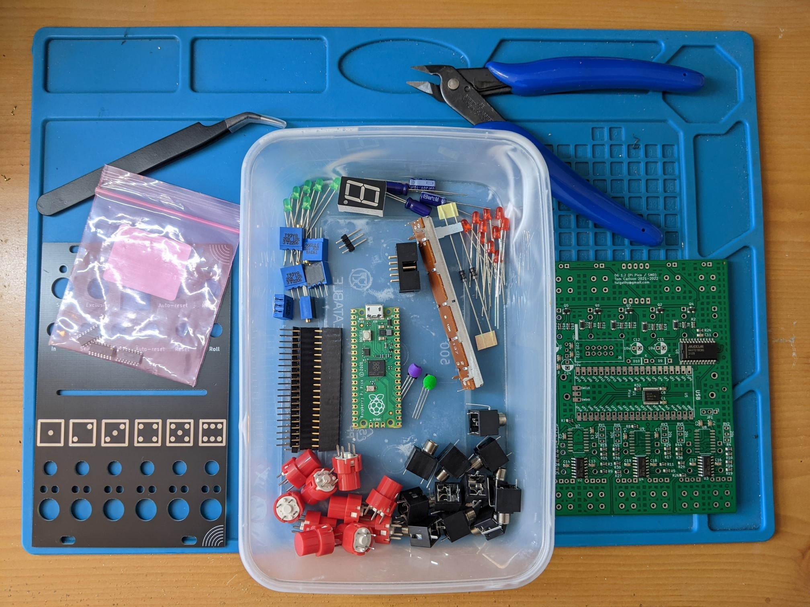
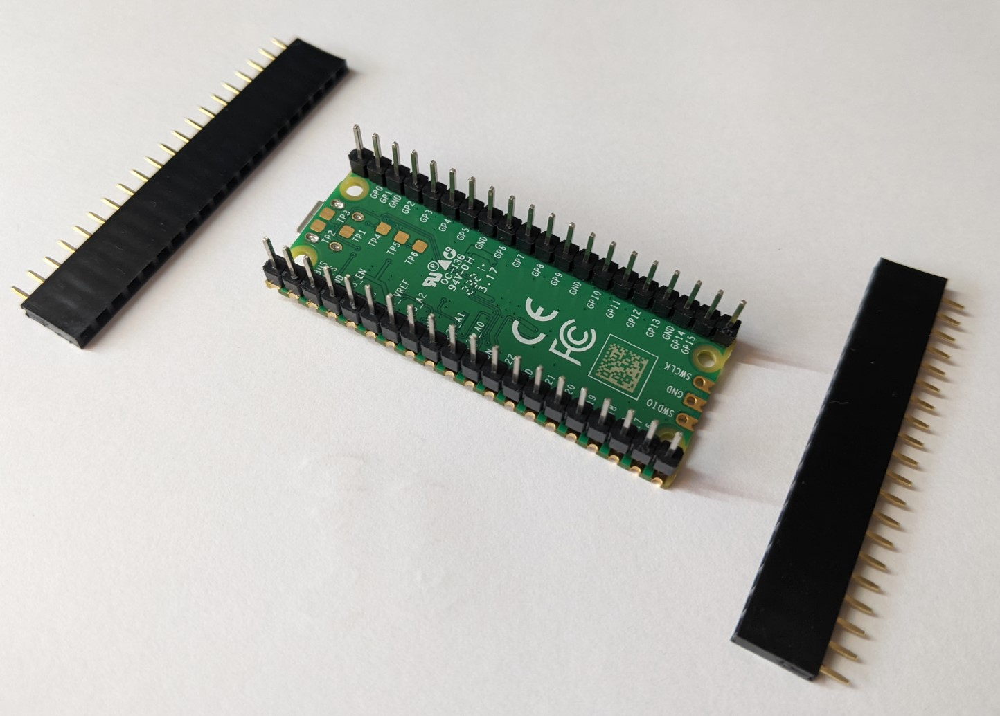
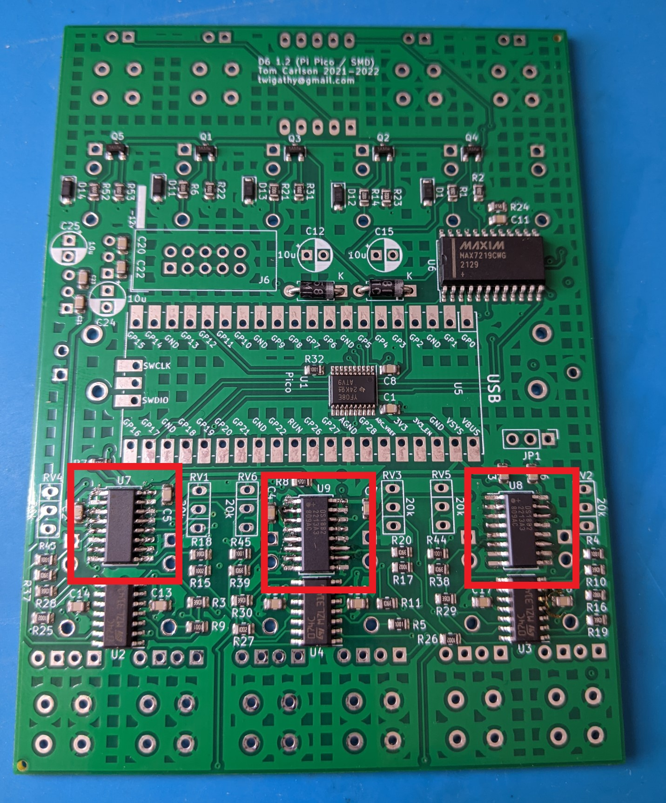
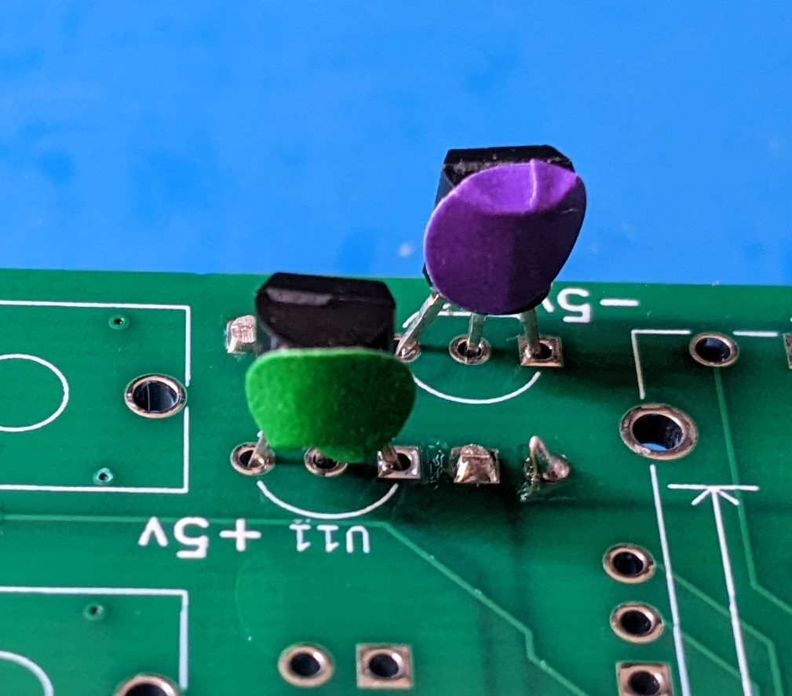
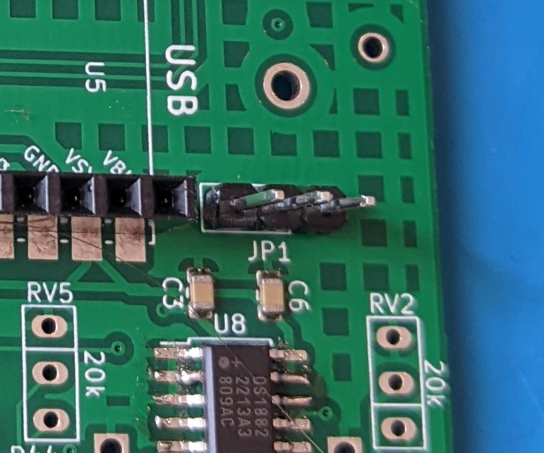
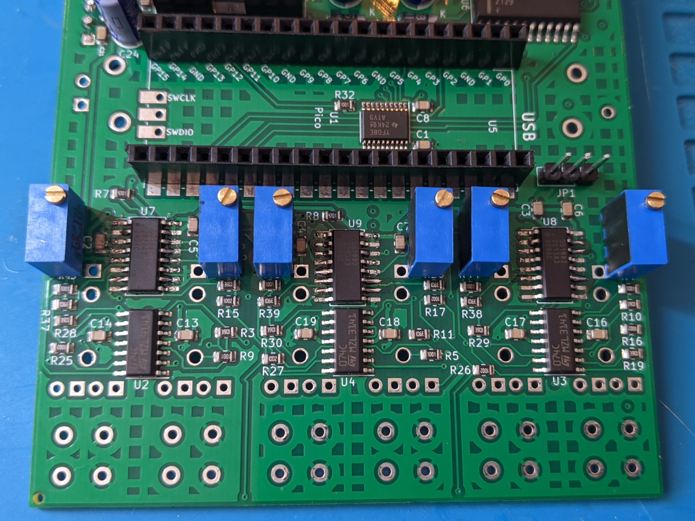
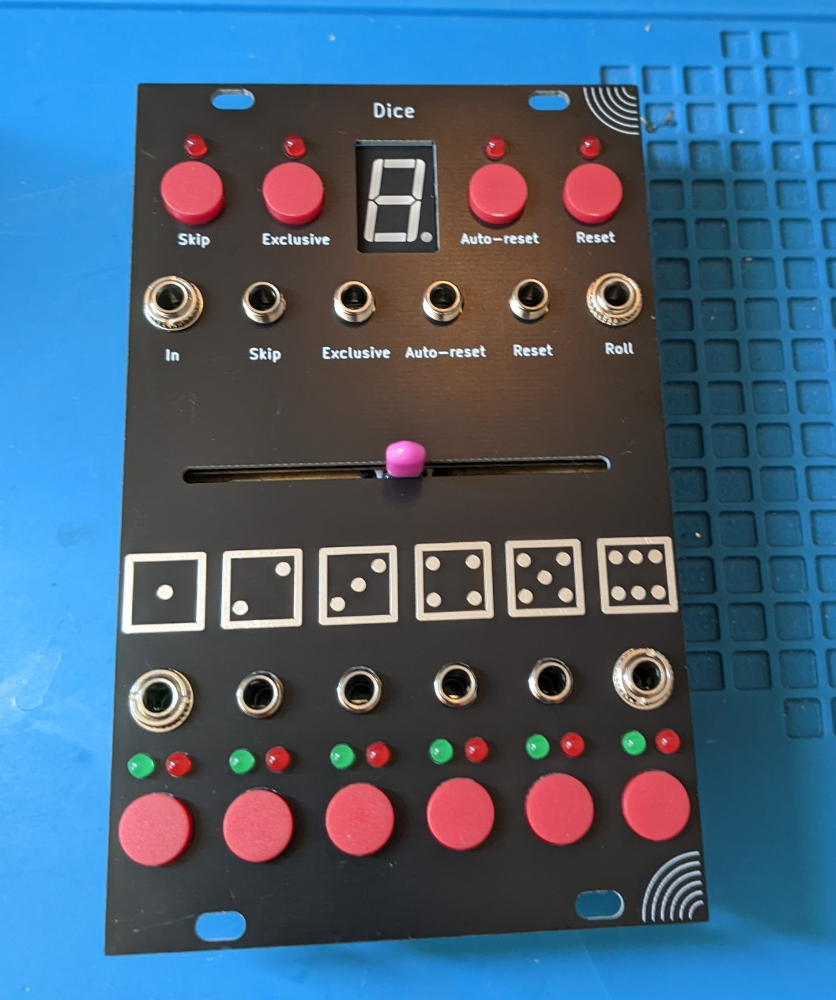
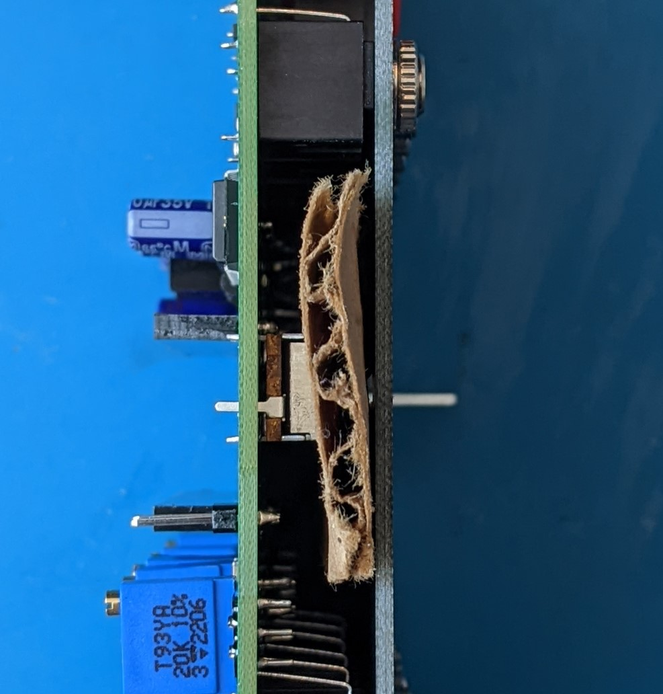

# Dice - Assembly

##### PCB Versions and kits

PCB version 1.0: Green solder mask, no central fader potentiometer, Teensy 3.2

PCB version 1.1: Green solder mask, central fader potentiometer, Teensy 3.2/4.0

PCB version 1.2+: Green solder mask, central fader potentiometer, Raspberry Pi Pico

Kits include PCB version 1.2+

##### Getting ready

First, gather together the tools you are going to use to assemble the module. At the bare minimum you should be able to do this with just a soldering iron, solder, and side cutters - but there are some additional tools that will make life easier:

- PCB vice or helping hands to hold the PCB in place
- Fan and absorbent material to get rid of solder/flux fumes
- Overhead lighting
- Silicone mat or scrap piece of wood to protect whatever surface you're soldering on
- Solder dispenser
- Tub to hold parts ready for soldering
- Multi-meter for continuity testing
- SMD Tweezers for handling small parts
- Flux and desoldering braid

Take a look through the [bill of materials](BOM.md) and make sure you have all the parts. I like to organise mine by putting them into tupperware or take-away boxes - if you do, just don't use them for food again afterwards.

###### Preparing the Raspberry Pi Pico

Find the 20-pin Female sockets 20-pin Male headers. Insert the headers into the back of the Raspberry Pi Pico (The side with pin labels).

To keep the pins straight while soldering, place the Female headers across the Male headers. Then flip everything over and solder the Raspberry Pi Pico's headers from the top.

Remove the Female headers and plug the Raspberry Pi Pico into  your computer. Flash it with the Dice firmware (XXX: Add link to firmware guide), and then set the Raspeberry Pi Pico aside for now.

###### Digital Audio Potentiometers

Find the three DS1882 Digital Audio Potentiometers. These are to be soldered just above the TL074 ICs on the back of the PCB. Whether you use solder paste and hot air, or a soldering iron, ensure that the DS1882 chips have pin 1 at the top-left. Pin 1 can be identified by the little dot on the IC.

###### Diodes, regulators and power

Bend the legs on the two schottky diodes and add them to the PCB. The line on the diode needs to align with the silkscreen on the PCB, with the lines on the right hand side. These diodes act as reverse polarity protection if the power cable is ever plugged in the wrong way around.

Flip the PCB over, and add the +5v and -5v regulators. Kits should come with stickers on the regulators: Green for the +5v 78L05 and Purple for the -5v 79L05. If the stickers fall off or otherwise get lost, the 78L05 should be placed into the +5v slot, and the 79L05 should be placed into the -5v slot.

Once you are happy with your soldering, remove the stickers from the regulators.

Flip the board over to the reverse once again, and add the capacitors. These are all the same value, but they need to be placed with the negative end (Coloured white) matching up with the silkscreen on the PCB.

Add the power socket next. It's best to solder one pin of this before flipping the board over and checking that it's sitting level before soldering the rest to make it a little easier to correct mistakes. The key for the header should be pointing downwards, towards where the Raspberry Pi Pico will be installed.

###### Raspberry Pi Pico

Retrieve the Raspberry Pi Pico and add the Female sockets to the Male headers. Insert the Female sockets into the PCB, flip the board over and solder them with the Pico still connected. This will help keep the Female sockets nice and aligned without worrying too much about holding everything perfect flat.

When you are happy with your soldering, remove the Pico from its socket and set it aside once again.

Finally, add a 3-pin Male header near the USB port of the Rasperry Pi Pico. This is unused in current firmware versions, but might serve a purpose in the future...

###### Trimmer Potentiomers

For the last step at the back of the PCB, add the 20k Trimmer Potentiomers to their respective slots. These help to dial in the voltage outputs a little more precisely than a fixed reisistor would, and should allow for accurate reproduction and routing of pitch CV as well as audio and gates.

###### Front panel parts

The rest of the parts in the kit should be used to populate the front panel. For the most part, this is just putting things in the right place!

Place but *do not solder* all of the buttons, the 7-segment LED display, the fader potentiomer, the Thonkiconn audio sockets, and the LEDs. 

Buttons all need to have their flat edge lined up with the silkscreen on the board.

LEDs should be placed with the long leg to the left hand side of the PCB, and the green LEDs should be placed to the left of the red LEDs in the bottom section.

Being very careful, slide the front panel over the top of the buttons and sockets. The panel should slide on neatly, but if it doesn't, check that all your buttons and sockets are correctly located in their spaces on the PCB. 

Add a couple of washers and nuts to some of the jacks to help keep everything together, or use an elastic band to go around the panel and main PCB if you have one handy. The LEDs and potentiometer will likely not stay up on their own yet.

Being very careful not to let the panel and the main board separate and spill components everywhere, flip the whole assembly over and start to solder the jacks. 

Solder one pin of each socket first, making sure that it lays flat against the PCB. This should help make everyting a little more solid before you carry on and solder the rest of the sockets' pins.

The buttons can be soldered in a similar way, going button by button and soldering one leg before soldering the rest. You may find it helpful to rest the buttons gently on a box to get their legs to poke through to the PCB. Make sure the buttons are lined up properly before soldering the rest of the pins - test out pressing each of them before soldering.

###### LEDs and 7-segment display

The 7-segment display should be pushed up against the panel as far as it can go while still letting its legs just poke through to the back of the PCB. This can be a bit fiddly to get right, but the holes in the PCB are deliberately a little small to allow for this to be a friction fit.

Before soldering, flip the board over and check that you're happy with where the display sits against the front panel.

Next, go through and solder the rest of the LEDs. There are 16 LEDs to solder, with most of them being free of too many other components - just take a little care with the LEDs at the bottom of the board near other SMD parts. Clip the legs short once you're done.

###### Slide potentiometer

Last but not least, solder the slide potentiometer. To keep it flat against the PCB, add in a piece of scrap cardboard between the top of the potentiometer and the back of the front panel. Solder the back parts, and you're done!

###### Finishing touches

Add the rest of the washers and nuts to the Thonkiconns, if you haven't done so already, and add the fader cap to the potentiometer.

###### Calibration and testing

With the Raspberry Pi Pico programmed and the module assembled, it's time to calibrate and test.

With the power plugged in, plug a cable into the first dice output of the module and into something that can measure voltages. This can be another module (Mordax Data for example), or your multimeter. Dice is normalled to 5v at its input, so we can use this to calibrate it without any other voltage sources. 

Turn the *right* most trimmer potentiometer until the measured voltage reads 5v.

Repeat this with the second dice output and trimmer potentiometer second from the right and so on until all channels have been calibrated.
