# Logic - Assembly

##### Getting ready

First, gather together the tools you are going to use to assemble the module. At the bare minimum you should be able to do this with just a soldering iron, solder, and side cutters - but there are some additional tools that will make life easier:

- PCB vice or helping hands to hold the PCB in place
- Fan and absorbent material to get rid of solder/flux fumes
- Beefier cutters for chopping up female headers
- Overhead lighting
- Silicone mat or scrap piece of wood to protect whatever surface you're soldering on
- Solder dispenser
- Tub to hold parts ready for soldering
- Multi-meter for continuity testing

Take a look through the bill of materials and make sure you have all the parts. I like to organise mine by putting them into tupperware or take-away boxes - if you do, just don't use them for food again afterwards.

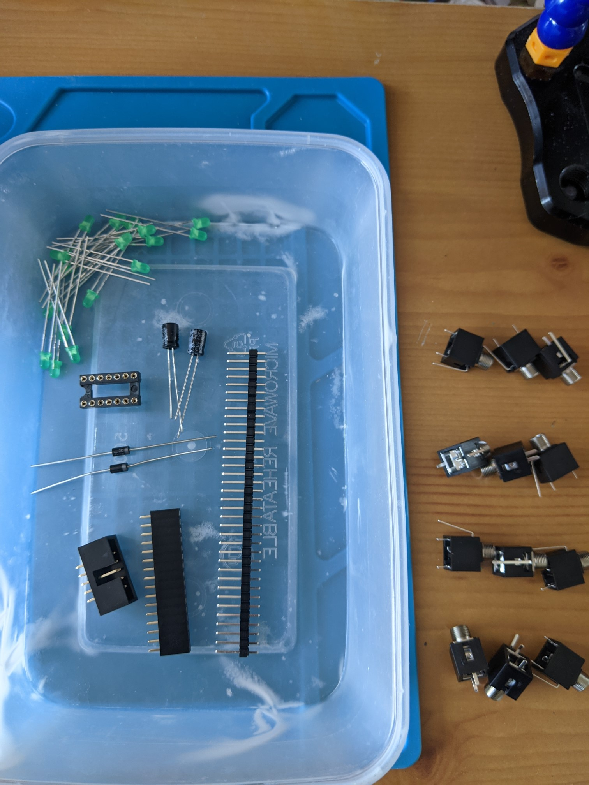

##### Power

First, place the low profile 10uF electrolytic capacitors into the board, following the silkscreen to match the negative side of the capacitor up with the silkscreen.

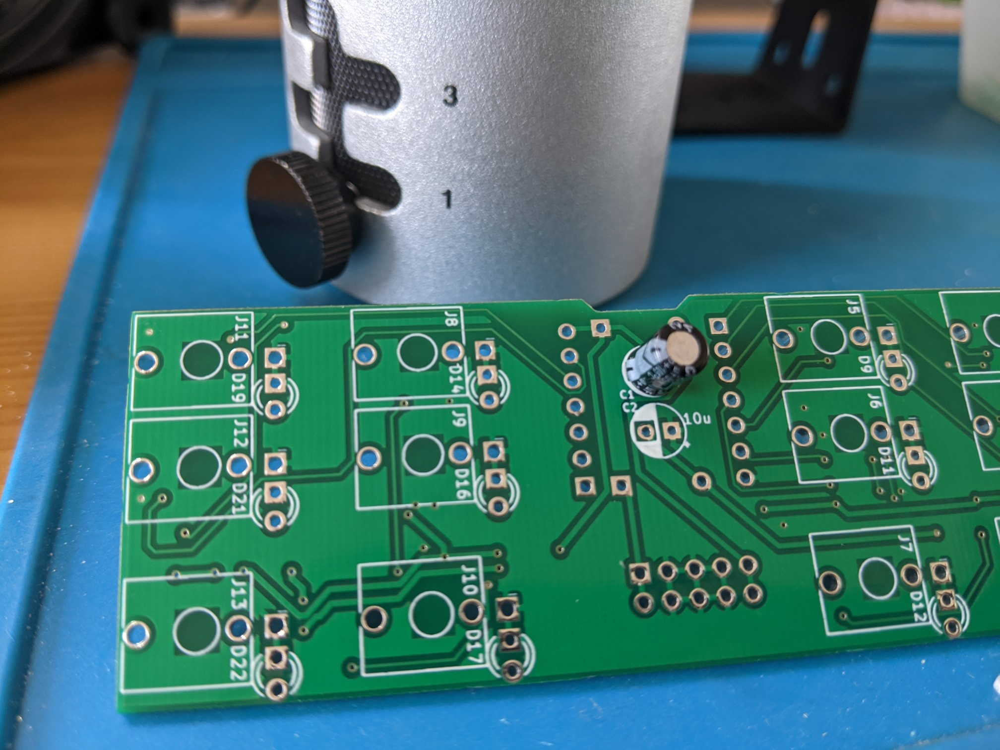

Next, bend the leads on the diodes so they match the spacing on the PCB and solder these too. I like to solder the diodes from the "top down", avoiding flipping over the PCB. You can also fold back one of the leads and solder from the back if you prefer.

Note that these are polarized parts like the capacitors, follow the silkscreen on the PCB to match the line on the diode with the line on the PCB. The lines should point towards the *bottom* of the PCB.

Next, the box header. This, too, is polarised. You will want to line the stripe on the PCB up with the notch on the bottom and stripe on the left hand side. If you're not sure, grab a power cable and verify before soldering.

When soldering the box header, I find it easiest to solder just one pin and check whether the header is in straight. If not, re-melting the solder and wiggling the header around a bit can help get it nice and flush to the PCB.

That's it! You're done with the power side of things.

##### Logic IC board

Next up is the small board for the logic IC. First, gather the parts you'll need and break the male and female pinheaders up into 2x 7 pin lengths. A 14 pin IC socket is also required. The female headers will need a strong cutter to cut - don't use your nice side cutters if you can avoid it.

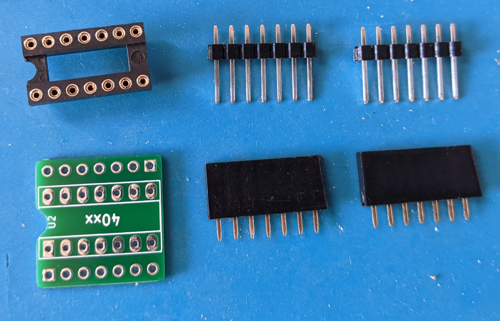

First, the IC socket. Drop the socket in as indicated by the silkscreen, being careful to align the notch on the IC socket with the notch on the PCB. Flip the board over and solder the two pins on opposite ends of the IC socket. Check that it lies flush with the PCB once you're done, and carry on to solder the rest of the pins.

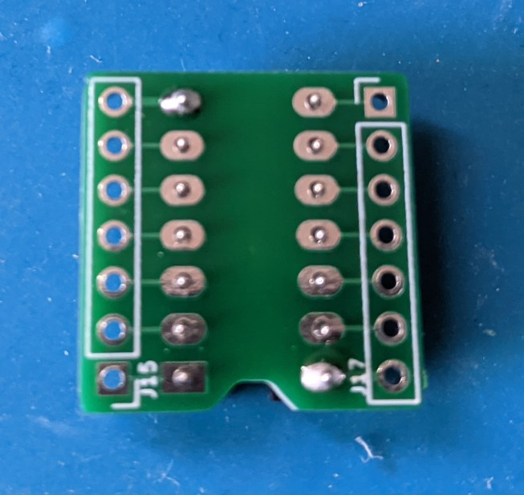

Next, take the male headers and put them into the opposite side the IC socket is installed, as indicated by the silkscreen on the PCB.

To keep the pins from wobbling around, take the female headers and place them across the male headers. You can skip this step if you like, and just solder the pins by hand, but I found this a little easier than trying to get the male pins to stand straight up without.

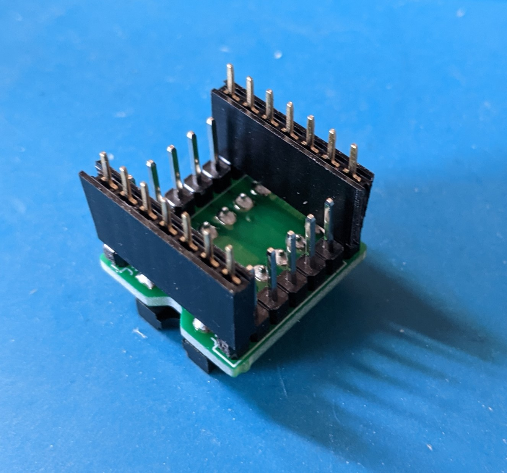

Solder these in, once again soldering one pin first on both sides and checking that everything looks straight before doing the rest.

Now take the female headers off their temporary home and stick the male ones into them.

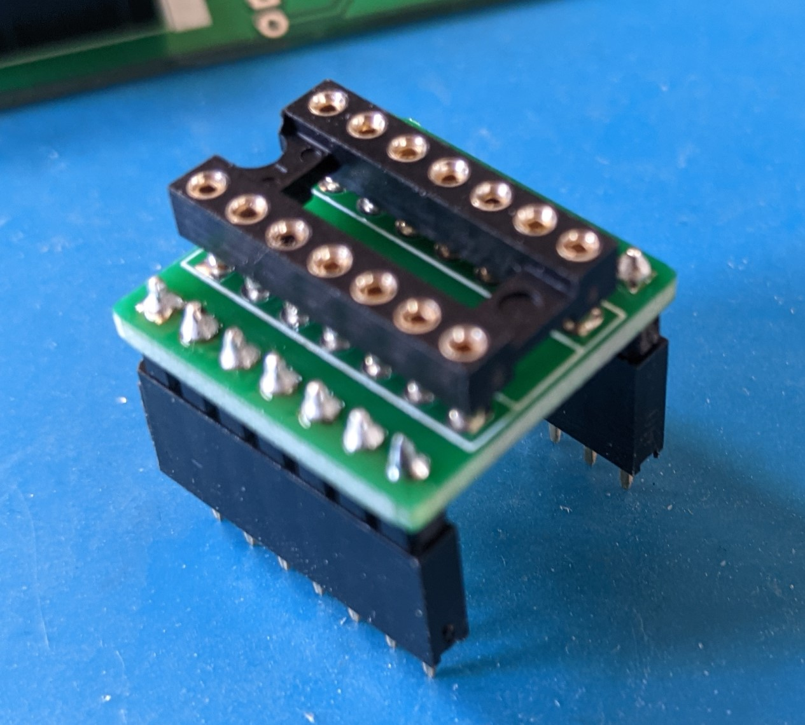

Put the small board into the main board, making sure that the notches in the main board and small board line up, and solder from the back.

That's all for the IC board.

##### Front panel components

Now that the power and logic parts are complete, you can start on the front panel components. Gather together the required LEDs and jack sockets. For now, it's best to ignore the top LEDs and the male header as they can get in the way a little when soldering.

Row by row, add jacks and LEDs. The LEDs need to be inserted so that the longer leg (The anode) is inserted into the _round_ hole on the PCB. I found that adding the jacks and LEDs at this point was a little easier using a PCB vice to grab one edge of the board, otherwise everything has a tendency to just pop out of the holes in the PCB!

Do not solder anything at this point - for the best alignment, wait until the front panel is on.

Using washers and nuts, secure the front panel to the jacks. Take four of the washers and nuts, securing the top left, right, bottom left and right jacks - the rest should stay in place on their own.

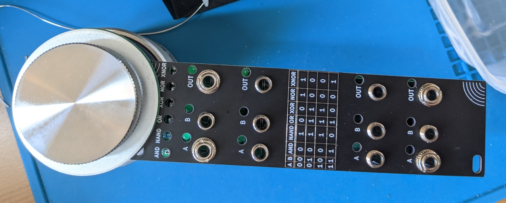

I moved the PCB vice to grab the front panel rather than the main PCB here.

Next, flip the PCB and panel over, locating the LEDs into their holes in the front - they just should drop in neatly if everything is aligned properly.

Solder the LEDs and jacks, being careful not to touch any of the small surface mount components. I found it easiest to do one row at a time, cutting the LED legs after finishing a row.

##### Indicator LEDs

Next up is the indicator LEDs. These help remind you which logic chip is installed into the module.

Remove the four nuts and washers added to secure the front panel to the jacks, and remove the front panel carefully.

Cut a male header to size (9 pins long), and insert it into the space as indicated by the silkscreen. I found it easiest to remove the small IC holder PCB from the main PCB to get the board to lay more flat when doing this.

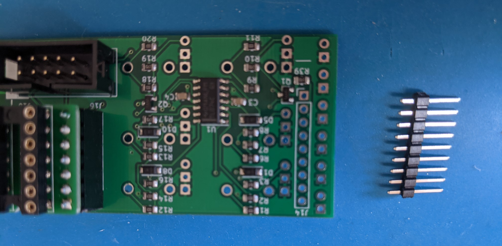

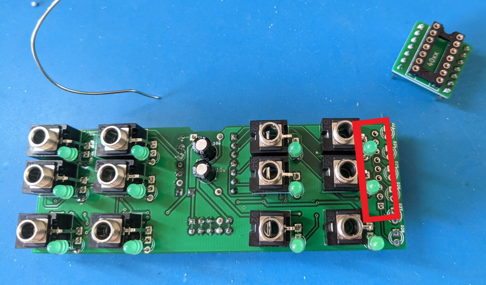

Next, add LEDs to the spaces left, as indicated by the silkscreen. Once again, make sure the long leg (The anode) goes into the round hole. Don't solder them yet!

Take the front panel and thread it carefully over the jacks and LEDs. Once again, add washers and nuts to a couple of the jacks to secure the panel to the main PCB, then slot the new indicators LEDs into their holes. Solder the indicator LEDs.

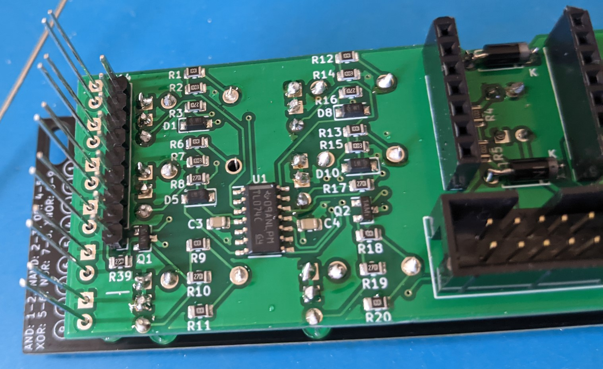

##### Finishing off

With the indicator LEDs installed, the front panel components are now complete! There are just a few things that remain before you can use the module.

First, choose which of the logic chips that you wish to use. I went for a CD4070 (xor) IC. The front panel has a list of the different chip numbers and their functions at the bottom on the reverse side, and there's also a section in the BOM for looking these chip numbers and functions up too.

Insert the IC into the IC socket, making sure that the notch on the PCB and IC socket match up with the one on the IC itself.

Then install into the main board, once again being mindful of alignment of notches.

Next, install the jumper across the pins in the top header so they match up with the chip you've installed. For example, here I've bridged pins 5 and 6 for xor.

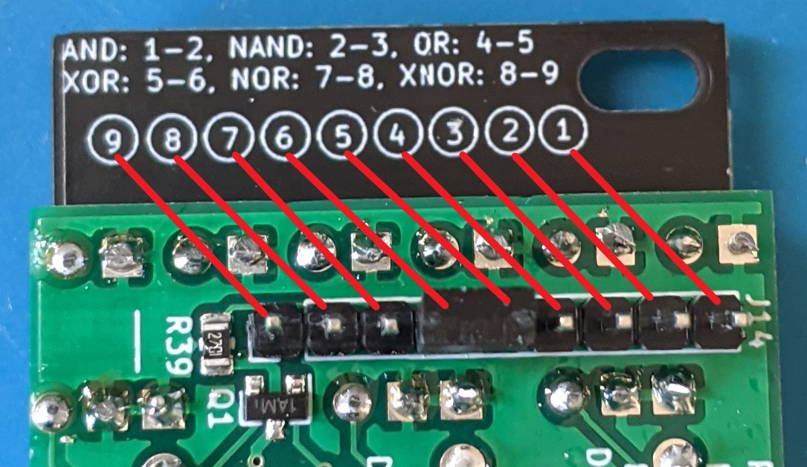

Next, a quick check for shorts. Set your multi-meter to continuity mode and bridge combinations of pins at the power socket.

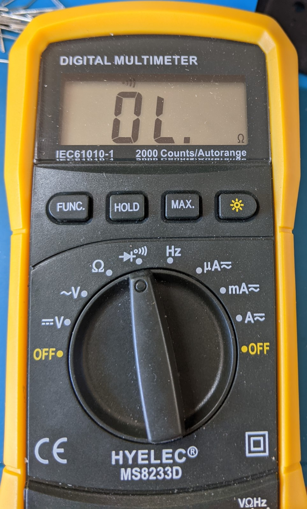

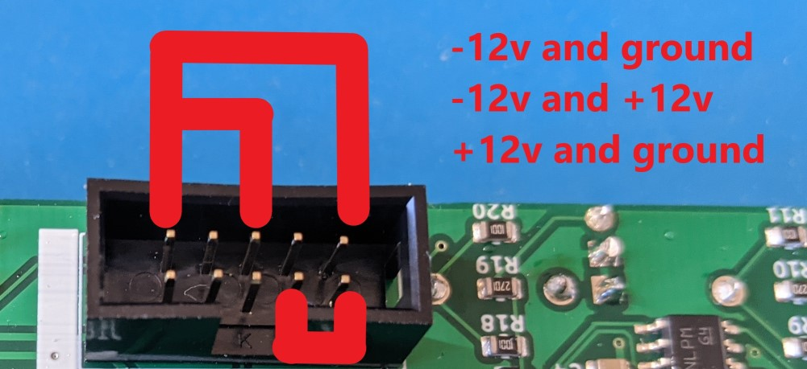

If any of these checks come back giving continuity then you probably have a short somewhere on the board - don't plug it in to find out, but do go back over your soldering and check there's no bridged pins or anything like that.

Add the rest of the washers and nuts to the remaining sockets to hold them securely in place.

Finally, If in the future you do want the swap the small PCB out for a different small PCB, be sure the turn off the power to your Eurorack system first - it's likely nothing will go wrong, but for the safety of your logic ICs and the rest of the system it's better to swap things out with the power turned off. 

That's it! You can now plug the module in and start to explore the world of logic gates.

