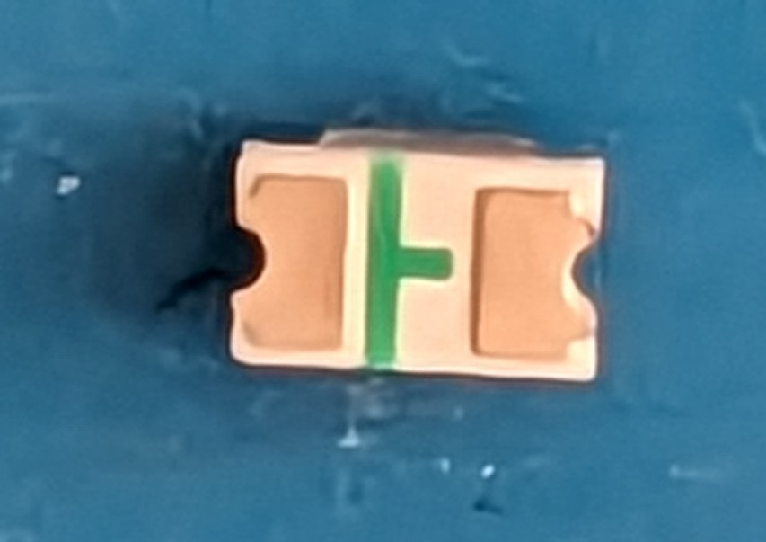
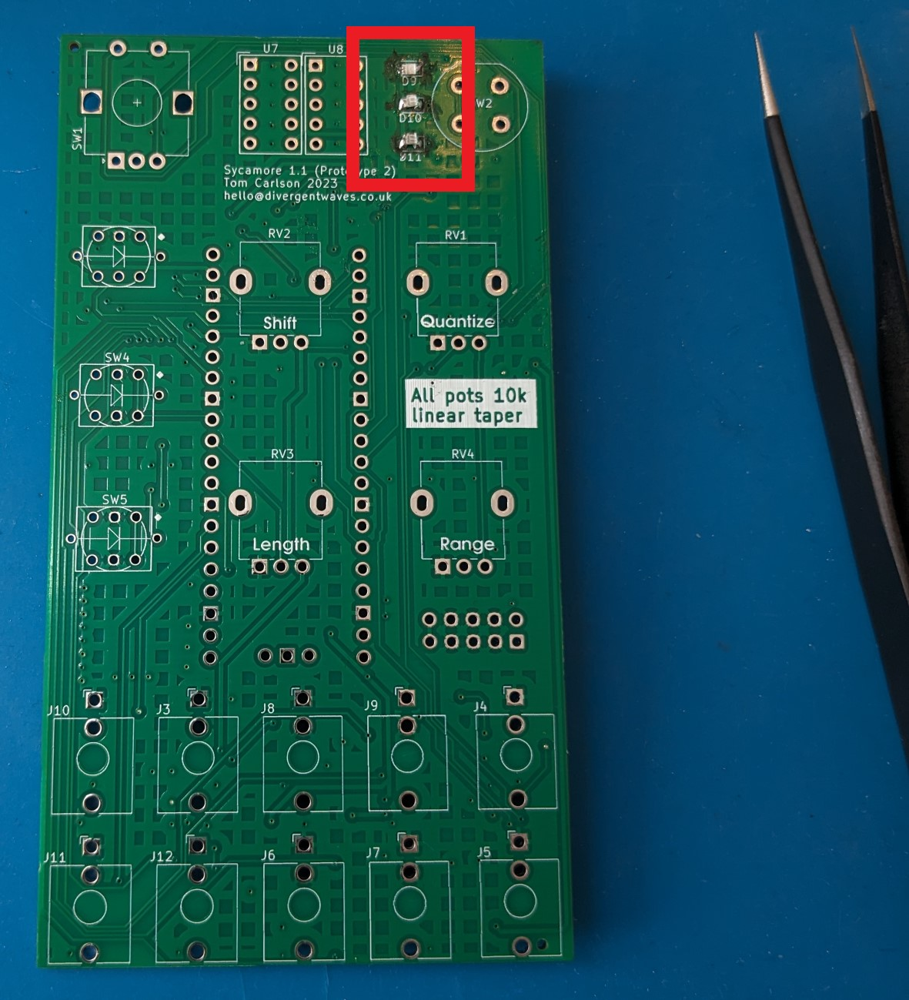
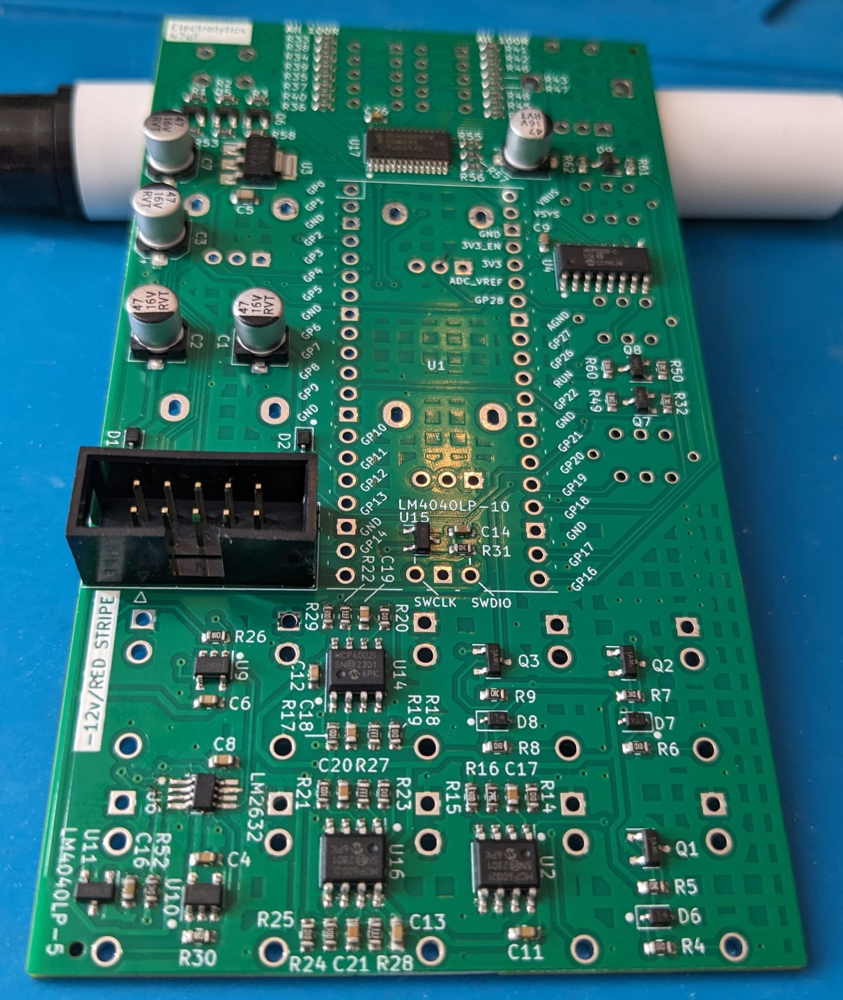
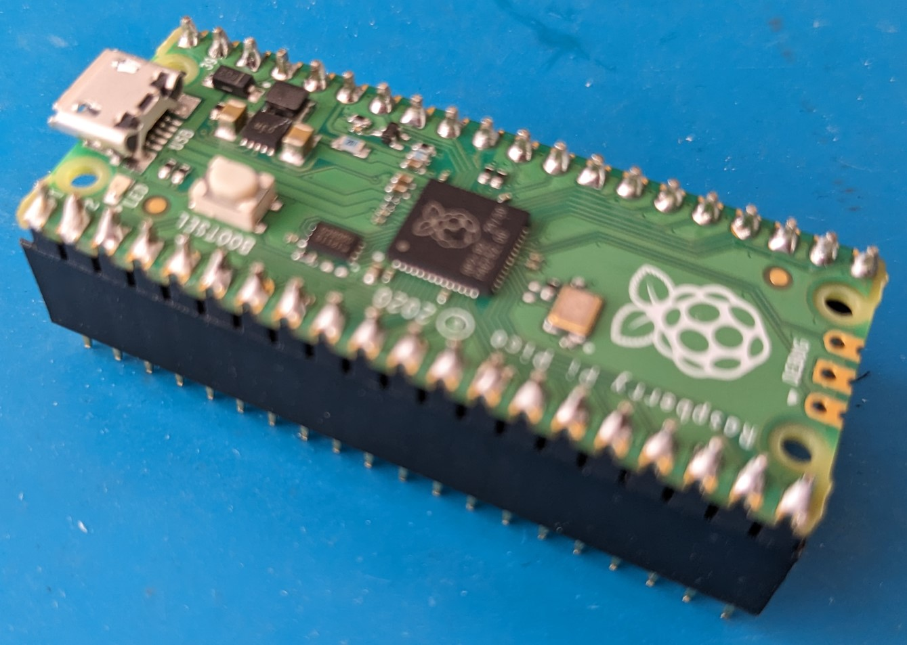
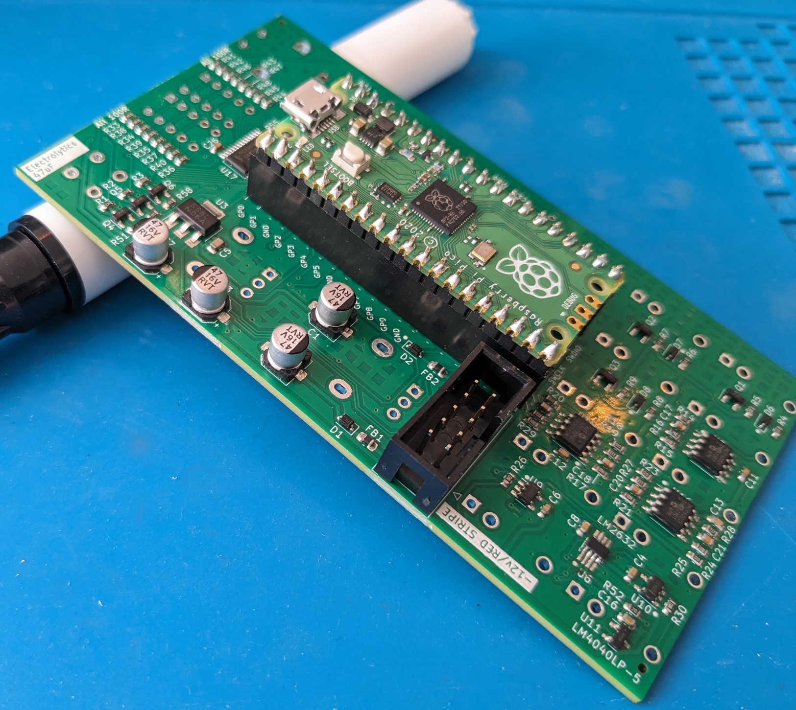
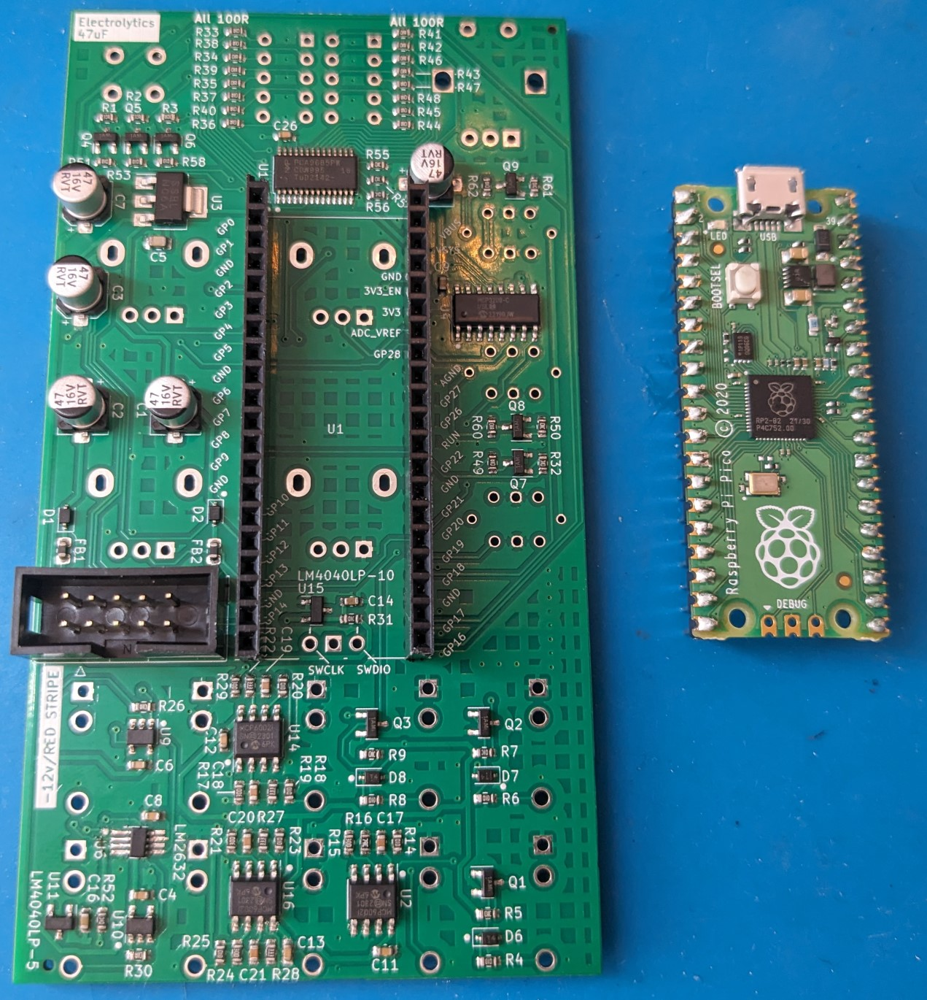
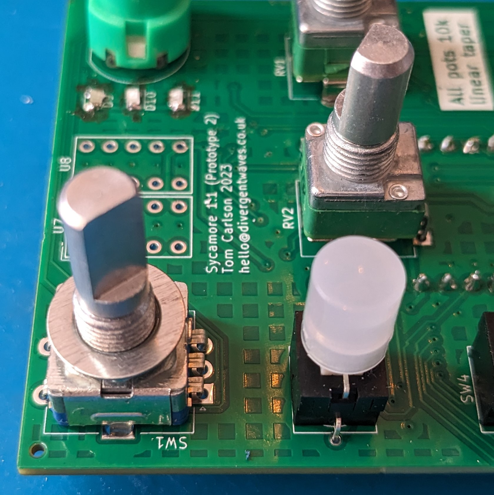
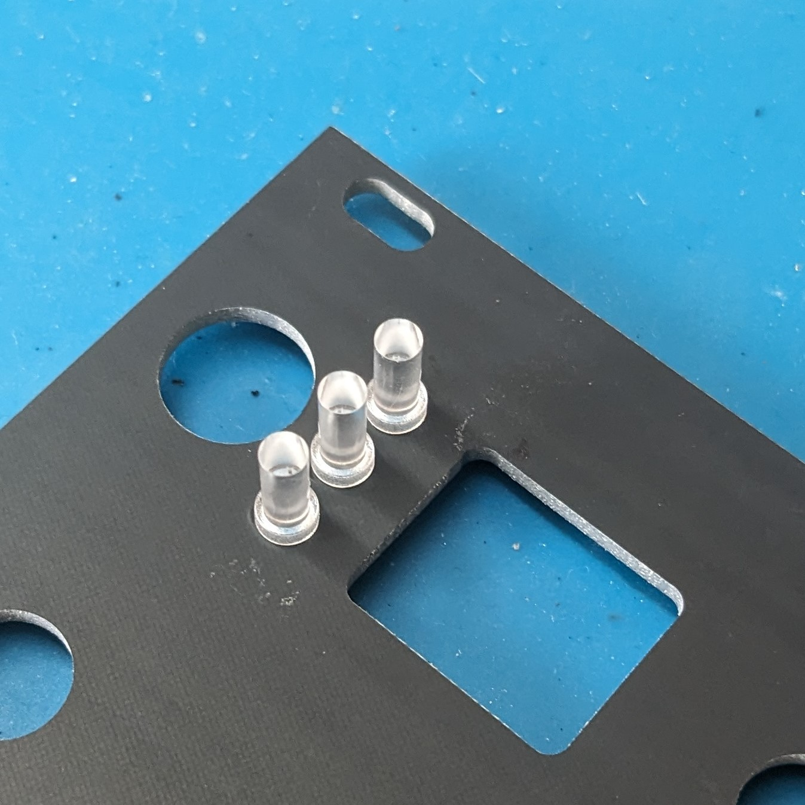
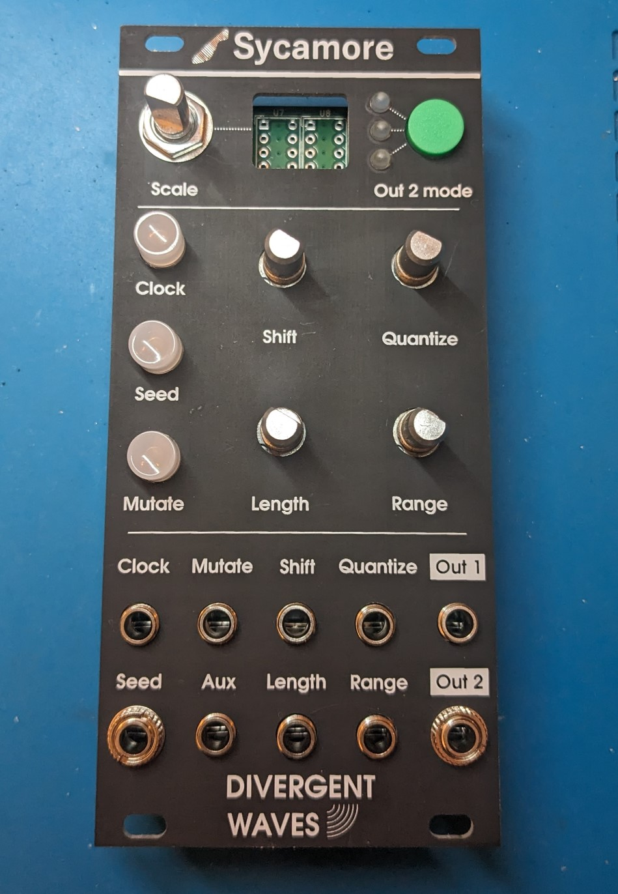
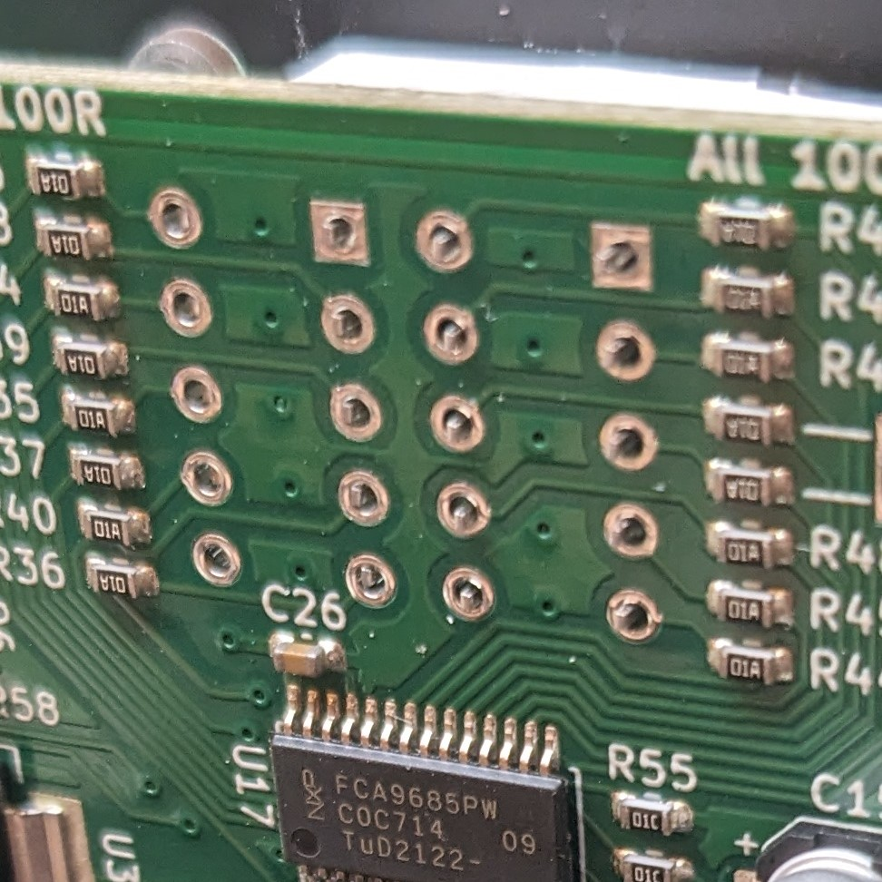

# Sycamore - Assembly

##### PCB Versions and kits

PCB versions 1.0 & 1.1 come _without_ the DAC soldered.

PCB versions 1.2+ come _with_ the DAC soldered.

PCB version 1.2-production has a [manufacturing mistake](images/1.2-production-cut-trace.png)! Expect to see one cut trace and one blob of solder bridging two pins on the ADC chip.

Kits for Sycamore include the headers and sockets for the Rasperry Pi Pico cut to size already.

##### Getting ready

First, gather together the tools you are going to use to assemble the module. At the bare minimum you should be able to do this with just a soldering iron & solder - but there are some additional tools that will make life easier:

- PCB vice or helping hands to hold the PCB in place
- Fan and absorbent material to get rid of solder/flux fumes
- Overhead lighting
- Silicone mat or scrap piece of wood to protect whatever surface you're soldering on
- Solder dispenser
- Tubs to hold parts ready for soldering
- Multi-meter for continuity testing

Take a look through the bill of materials and make sure you have all the parts. I like to organise mine by putting them into tupperware or take-away boxes - if you do too, just don't use them for food again afterwards.

###### Preparing the Pico

First, solder the headers to the Pico. To hold everything in place, use a couple of sockets.

Now you can solder the headers to the Pico. Remove the sockets once you're done and the Pico is good to go.

If you are building this from your own parts, cut down some sockets to size (2 sets of 20 pins) to match the Pico, you'll use these a bit later. Kits will have these headers cut to size already.

Connect the Pico to your computer and program it with the firmware. See the [FIRMWARE.md](FIRMWARE.md) guide for more details.

##### LEDs

The mode LEDs are first to solder. On the back of the LED is a long vertical line, this indicates the 5V side, which is on the left hand side of the module. [This page](https://lighthouseleds.com/blog/polarity-guide-of-0402-0603-0805-1206-and-most-all-smd-leds.html) has a good set of pictures for common LED indicators in case yours are different.

The vertical line on the LEDs (The anode) should be on the left hand side of the PCB. The indicator line should be on the bottom of the LED as you place it, with LED's lens facing up.

You can decide how exactly to solder the LEDs. Either a hot air gun and paste or a soldering iron will work. A hotplate will not work as there are already parts on the other side.

To solder with a soldering iron, first add a little bit of solder to one of the pads, place the LED on top of this, then reflow the solder with your iron before soldering the second pad.

If you're going to use a soldering iron, make sure not to hold the iron on the solder joints for too long to avoid damaging the LEDs.

Here you can see an in-progress shot from soldering with hot air and paste where I added a little too much of the paste Your soldering should look much cleaner than this!

##### Rear components (Pico, power)

Now solder the rear components. Start with the power connector. This should be placed respecting the silkscreen, with the notch pointed towards the bottom of the PCB. Solder one or two pins then check that the power connector is sitting flush with the PCB before soldering the rest of the pins.

Slot the Rasperry Pi Pico with its soldered headers from the first step into the 20-pin sockets. Insert into the PCB with the USB port on the Rasperry Pi Pico pointing upwards. As with the power connector, solder a couple of pins and make sure the headers are flush with the PCB before soldering the rest.

 

##### Front panel parts (Pots, jacks, buttons, and light pipes)

Gather up the remaining front panel parts and add them to the PCB. It's best to do this in a certain order as some parts are a bit more fiddly than others to install. Do not solder any of these parts yet!

- Start with the Rotary Encoder in the top-left. Make sure the three legs are pointed towards the bottom of the board!

- Add the four 10k potentiometers. These can sometimes be a very tight fit - straightening the legs on the side a little will make placing them a little easier

- Add the three LED buttons along the left side of the PCB. These have a small, green dot which should face the right hand side, towards the potentiometers. The PCB also has a dot showing the proper orientation

- Add the 10 mono Thonkiconn sockets to the bottom of the PCB. Make sure they all lie flat against the PCB.

- Add the round button to the top-right of the PCB. Make sure the flat edge of the button is pointing upwards, as indicated by the silkscreen on the PCB

- 

##### Light pipes

Light pipes are a press-fit item, just press them firmly into the panel from behind. If you find the light pipes are not gripping the panel material as firmly as you like, carefully apply a little cyanoacetate superglue to bond them to the panel securely.

##### Securing front panel parts

Thread the panel carefully over the front panel components. Take care with the round button which has shorter legs than the other parts.

Secure the front panel to the PCB by adding:

- Another nut to the rotary encoder

- Washers and then nut to the potentiometers

- A couple of washers and nuts to the audio jacks

I prefer to just secure two or four of the audio jacks at this point, if anything is wrong with the soldering then undoing all the nuts is a bit of a pain!

At this point, it's worth testing the rotation of the potentiometers and encoder, and the action of the buttons to make sure everything feels correct.

##### Soldering the front panel parts

Very carefully flip the module over and start soldering the front panel parts. It's best to solder the parts that had nuts and washers added first as these are the "glue" that'll hold everything else together. Especially for the Thonkiconn sockets, solder one pin and then make sure that they are totally flush to the main PCB before soldering the rest.

Take particular care when soldering the center-most potentiometers - these are between the sockets for the Rasperry Pi Pico. Don't melt the sockets!

Solder the round button at the top-right last, making sure the flat edge is at the top.

##### 7 segment displays

Insert the 7 segment displays into the slots at the top of the module, making sure that the decimal point is in the bottom-right hand side. You can either feed the 7 segments through the gap between the panel and the PCB, or through the cutout in the front of the panel.

The two 7 segment displays need to be soldered with as small amount of their legs visible on the back of the PCB as possible to get them close to the front panel. It can be helpful to tape the two displays together to keep them aligned, and to use scrap cardboard or another spacer while soldering to ensure the proper height.

Solder one pin on each display and flip the module over to check the display is centered before soldering the rest of the pins.

##### Finishing off the front panel

Add D-shaft knobs to the four potentiometers, and a D-shaft knob to the encoder. Make sure the encoder can be pressed down to press it.

If you're feeling confident at this point, add the rest of the washers and nuts to the Thonkiconn sockets. It can be helpful to leave this step to the end in case you need to take the module apart to fix up some soldering, though!

##### Adding the Rasperry Pi Pico

If you skipped programming the Pico previously, now is the time to revisit the [FIRMWARE](FIRMWARE.md) guide.

Insert the programmed Rasperry Pi Pico with its headers into the sockets on the back of the board. The three holes on the Pico should match the 3 holes in the PCB (Although no pins/sockets are present there), with the USB port pointing up towards the 7-segment displays.

###### Testing

No calibration is needed.

Check for shorts by probing the power header with your multimeter. There should be no continuity between +12v and ground, -12v and ground, or +12v and -12v.

Ensuring the power is turned off first, plug the module into your Eurorack.

With all the knobs at 12-o-clock, plug output 1 into a VCO. Press the clock button (It should briefly light) and listen to the VCO's output. If everything is correctly soldered and the firmware flashed, the pitch for the VCO should change as the notes output by Sycamore change with successive clock button presses.

See [MANUAL.md](MANUAL.md) for how to use the module.